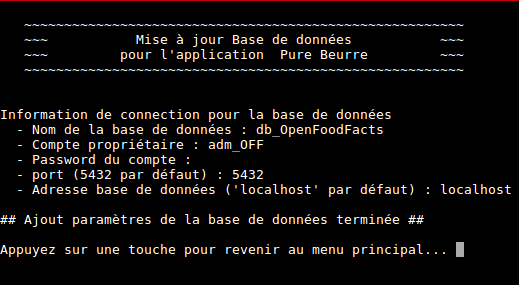
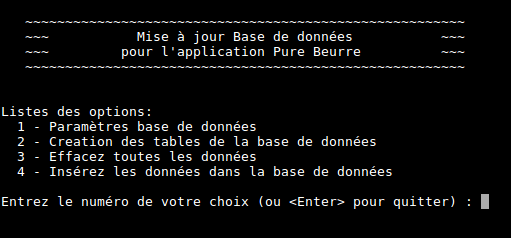
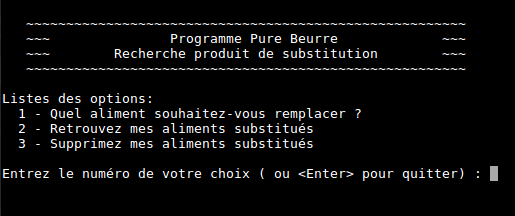
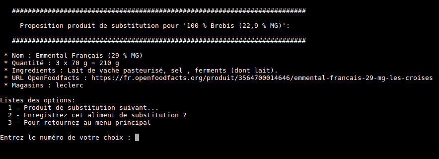
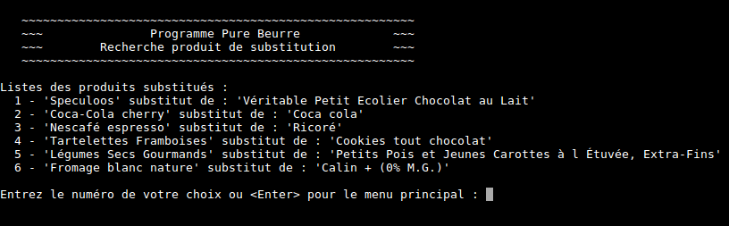

# use-OpenFoodFacts

This program was created for the company Pure Beurre to perform a food search in the OpenFoodFacts database to find an equivalent.

## Start guide

### Dependencies

- [Python 3.5 or more](https://www.python.org) is required.
- [PostGreSQL](https://www.postgresql.org/download/)

### Installation instructions

- install Python 3.x
- install PostgreSQL

Create a database and a proprietary user account for this database.

Ubuntu example:

    $ sudo -i -u postgres
    $ createuser -P --interactive <user_name>
    Enter password for new role:
    Enter if again:
    Shall the new role be a superuser? (y/n) n
    Shall the new role be allowed to create databases? (y/n) y
    Shall the new role be allowed to create more new roles? (y/n) y
    $ createdb -O <user_name> -E UTF8 <database_name>

Collect the use-OpenFoodFacts repo and install the dependencies as below:

    $ git clone https://github.com/Nels885/use-OpenFootFacts.git
    $ cd use-OpenFoodFacts
    $ pip3 install -r requirements.txt

## Integrate OpenFoodFacts data into the database

Then run the python script below to retrieve the OpenFoodFacts data for embedding in the database.

    $ python3 update_db.py

At the first launch it is necessary to indicate the information for the connection to the database as below.

- database name
- user
- password
- used port
- address database

Then you will find yourself on the menu below, if you do not make any mistake in the settings otherwise the program will ask you to start again.

Choose option "2" to create the tables in the database and finish option "4" to insert the OpenFoodFacts data in the tables.

## How to use the client program

Run the program in the terminal.

    $ python3 purebeurre_client.py

This one will ask you two different questions in French which are:

    1 - Quel aliment souhaitez-vous remplacer ? 
    2 - Retrouvez mes aliments substitués.
    3 - Supprimez mes aliments substitués.

- Select one with the numeric keypad and confirm with the **enter** key.
- Then it will offer you several choices of categories, select in one thanks to the corresponding numeric key and validate.
- You will then have a list of foods that matches the category, select as before.

The program offers you a substitute products as below :

- The option "1" allows you to see the next substitute product.
- You will also be able to register the substitute product in the database with option "2".

If you choose the option "2" from the main menu, you can display the substitute products saved in the database:

The option "3" from the main menu, allows you to delete registered substitute products.
